# Architecture Overview - Azure WebApp Demo

## Project Overview

This Azure WebApp Demo showcases a complete, production-ready web application deployment using modern Azure services, Infrastructure as Code (Terraform), and DevOps best practices. The project demonstrates PII handling, cost management, and automated cleanup in a simplified, demo-friendly format.

## Architecture Diagrams

### Complete System Architecture

```mermaid
graph TB
    %% User Access Layer
    User[End Users] --> LB[Azure Load Balancer]
    Dev[Developers] --> GitHub[GitHub Repository]

    %% GitHub Actions & CI/CD
    GitHub --> GHA[GitHub Actions]
    GHA --> |OIDC Auth| Azure[Azure Cloud]

    %% Deployment Options
    subgraph "Deployment Methods"
        GHA --> |Primary| WebUI[GitHub Web UI]
        GitHub --> |Primary| CLI[Command Line]
        Dev --> |Alternative| Local[Local Deployment]
    end

    %% Azure Infrastructure
    subgraph Azure ["Azure Cloud Platform"]
        subgraph RG ["Resource Group webapp-demo-dev-rg"]

            %% Compute Layer
            subgraph Compute ["Compute Services"]
                ASP["App Service Plan<br/>S1 Standard<br/>HA Compliant"]
                WebApp["Linux Web App<br/>Python Flask<br/>Container-based"]
                ACR["Container Registry<br/>Docker Images"]
            end

            %% Data Layer
            subgraph Data ["Data Services"]
                SQL["Azure SQL Database<br/>S0 Standard<br/>HA Compliant"]
                SQLServer["SQL Server<br/>TLS Encrypted"]
            end

            %% Security Layer
            subgraph Security ["Security Services"]
                KV["Azure Key Vault<br/>Secrets Management<br/>PII Compliance"]
                MI["Managed Identity<br/>Passwordless Auth"]
            end

            %% Monitoring Layer
            subgraph Monitoring ["Monitoring Services"]
                LAW["Log Analytics<br/>Workspace"]
                AI["Application Insights<br/>APM & Telemetry"]
                CM["Cost Management<br/>Budget Alerts"]
            end

            %% Automation Layer
            subgraph Automation ["Automation Services"]
                AA["Automation Account<br/>Cleanup Jobs"]
                Schedule["Runbook Scheduler<br/>2-Hour Cleanup"]
            end
        end
    end

    %% Infrastructure as Code
    subgraph IaC ["Infrastructure as Code"]
        TF["Terraform<br/>Single main.tf<br/>HA Defaults"]
        TFState["Terraform State<br/>Local/Remote"]
    end

    %% Application Architecture
    subgraph AppArch ["Application Architecture"]
        Flask["Flask Application<br/>Python 3.11"]
        DB["Database Layer<br/>PyODBC Connection"]
        API["REST API<br/>Quote Endpoints"]
    end

    %% Data Flow
    subgraph DataFlow ["Data Flow"]
        MockPII["Mock-PII Data<br/>Famous Sports Quotes<br/>WARNING Demo Only"]
        Seeding["Database Seeding<br/>Automatic on Startup"]
        Quotes["Random Quotes<br/>ORDER BY NEWID()"]
    end

    %% Cost Management
    subgraph FinOps ["FinOps & Cost Management"]
        Budget["Budget Alerts<br/>$10 Default"]
        Monitor["Cost Monitoring<br/>Real-time Tracking"]
        Cleanup["Auto Cleanup<br/>2-Hour Timer"]
        Dashboard["Cost Dashboard<br/>HTML Reports"]
    end
    
    %% Connections - Infrastructure
    LB --> WebApp
    WebApp --> ASP
    WebApp --> ACR
    WebApp --> SQL
    WebApp --> KV
    WebApp --> MI
    WebApp --> AI
    SQL --> SQLServer
    
    %% Connections - Monitoring
    WebApp --> LAW
    AI --> LAW
    CM --> Budget
    AA --> Schedule
    
    %% Connections - Deployment
    TF --> RG
    Local --> TF
    CLI --> GHA
    WebUI --> GHA
    
    %% Connections - Application
    Flask --> DB
    DB --> SQL
    API --> Flask
    MockPII --> Seeding
    Seeding --> SQL
    SQL --> Quotes
    
    %% Connections - FinOps
    Monitor --> CM
    Budget --> Monitor
    Cleanup --> AA
    Dashboard --> Monitor
    
    %% Security Connections
    MI --> KV
    MI --> SQL
    MI --> ACR
    KV --> |Connection String| WebApp
    KV --> |PII Data| MockPII
    
    %% Styling
    classDef azure fill:#0078d4,stroke:#005a9e,stroke-width:2px,color:#fff
    classDef security fill:#d73502,stroke:#a02c02,stroke-width:2px,color:#fff
    classDef data fill:#00bcf2,stroke:#0099cc,stroke-width:2px,color:#fff
    classDef compute fill:#7fba00,stroke:#5e8b00,stroke-width:2px,color:#fff
    classDef monitoring fill:#ffb900,stroke:#cc9400,stroke-width:2px,color:#fff
    classDef automation fill:#68217a,stroke:#4a1755,stroke-width:2px,color:#fff
    classDef warning fill:#ff6b35,stroke:#cc5529,stroke-width:3px,color:#fff
    
    class Azure,RG azure
    class KV,MI security
    class SQL,SQLServer,DB data
    class WebApp,ASP,ACR compute
    class LAW,AI,CM monitoring
    class AA,Schedule automation
    class MockPII warning
```



## Key Architecture Components

### Compute Services
- **App Service Plan (S1 Standard)**: HA-compliant tier for production readiness
- **Linux Web App**: Container-based Python Flask application
- **Azure Container Registry**: Secure Docker image storage

### Data Services
- **Azure SQL Database (S0 Standard)**: HA-compliant database tier
- **TLS Encryption**: All database connections encrypted in transit
- **Automatic Seeding**: Mock-PII data loaded on application startup

### Security Services
- **Azure Key Vault**: Centralized secrets and PII data management
- **Managed Identity**: Passwordless authentication between Azure services
- **OIDC Authentication**: GitHub Actions to Azure authentication

### Monitoring & Cost Management
- **Application Insights**: APM and telemetry collection
- **Log Analytics Workspace**: Centralized logging and monitoring
- **Cost Management**: Budget alerts and real-time cost tracking
- **Automated Cleanup**: 2-hour timer for cost protection

### Automation Services
- **Azure Automation Account**: Scheduled cleanup jobs
- **Python Runbooks**: Cross-platform cleanup automation
- **Background Timers**: Local and cloud-based cleanup scheduling

## Deployment Architecture

### Two Primary Deployment Methods

1. **GitHub Actions Web UI**: One-click deployment from browser
2. **Command Line + GitHub Actions**: `./scripts/deploy-github.sh`

**Alternative**: Local development with `./scripts/deploy.sh`

### Infrastructure as Code

- **Single Terraform Configuration**: Simplified `main.tf` with HA defaults
- **Environment-based Variables**: Dev/staging/prod configurations
- **State Management**: Local state for demo, remote for production

### GitHub Actions Workflow

**Single Workflow Design**: One primary workflow (`Azure WebApp Demo`) handles:
- **Automatic Validation**: Triggers on code changes (no deployment)
- **Manual Deployment**: "Run workflow" button for full deployment
- **Command Line Integration**: API trigger via scripts

**Benefits**: No confusion with multiple workflows, clear deployment process

## Security Architecture

### PII Compliance Framework

**Demo Limitation**: Mock-PII data (famous sports quotes) included in source control for demonstration purposes. This violates PII best practices.

**Production Architecture**:
- PII data stored in Azure Key Vault
- Secure data loading from external sources
- No PII data in source control or container images
- Comprehensive audit logging

### Authentication Flow

1. **GitHub Actions**: OIDC trust with Azure AD App Registration
2. **Application**: Managed Identity for Azure service access
3. **Database**: Connection strings from Key Vault
4. **Container Registry**: Managed Identity authentication

## Cost Management Architecture

### FinOps Best Practices

- **Budget Alerts**: Configurable spending thresholds
- **Real-time Monitoring**: Cost tracking and reporting
- **Automatic Cleanup**: Multiple cleanup mechanisms
- **Resource Optimization**: HA-compliant but cost-effective tiers

### Cleanup Mechanisms

1. **Local Timer**: Background process with sleep timer
2. **Azure Automation**: Scheduled runbook execution
3. **Manual Cleanup**: `./scripts/cleanup.sh` for immediate cleanup

## Application Architecture

### Flask Application Stack

- **Python 3.11**: Modern Python runtime
- **Flask Framework**: Lightweight web framework
- **PyODBC**: Azure SQL Database connectivity
- **Container Deployment**: Docker-based deployment

### API Endpoints

- `/` - Random quote API (JSON) - Main application endpoint
- `/healthz` - Application health check (JSON)
- `/db-test` - Database connectivity test (JSON)
- `/db-validate` - Database validation with schema and sample data (JSON)
- `/quote-with-source` - Quote with database source validation (JSON)

**Note**: All endpoints return JSON responses. There is no HTML interface in this API-focused application.

### Database Schema

```sql
CREATE TABLE dbo.quotes (
    id INT IDENTITY(1,1) PRIMARY KEY,
    author NVARCHAR(255) NOT NULL,
    text NVARCHAR(2000) NOT NULL
);
```

## Monitoring Architecture

### Observability Stack

- **Application Insights**: Performance monitoring and telemetry
- **Log Analytics**: Centralized log aggregation
- **Cost Management**: Financial monitoring and alerting
- **Health Checks**: Application and infrastructure monitoring

### Key Metrics

- Application performance and availability
- Database connection health
- Cost consumption and trends
- Resource utilization

## Production Migration Path

### From Demo to Production

1. **Secure PII Storage**: Migrate data to Azure Key Vault
2. **Enhanced Security**: Implement proper access controls
3. **Monitoring Enhancement**: Comprehensive observability
4. **Backup Strategy**: Data protection and recovery
5. **Compliance**: GDPR, CCPA, industry-specific requirements

See `docs/mock-pii-disclaimer.md` for detailed migration guidance.

## Technology Stack

### Core Technologies
- **Infrastructure**: Terraform, Azure Resource Manager
- **Application**: Python 3.11, Flask, PyODBC
- **Database**: Azure SQL Database, T-SQL
- **Containers**: Docker, Azure Container Registry
- **CI/CD**: GitHub Actions, Azure CLI
- **Monitoring**: Application Insights, Log Analytics
- **Security**: Azure Key Vault, Managed Identity

### Development Tools
- **Cost Management**: Azure Cost Management API
- **Testing**: pytest, integration tests
- **Documentation**: Markdown, Mermaid diagrams
- **Automation**: Bash scripts, Python automation

This architecture demonstrates modern cloud-native application development with proper security, monitoring, and cost management practices while maintaining simplicity for demonstration purposes.
